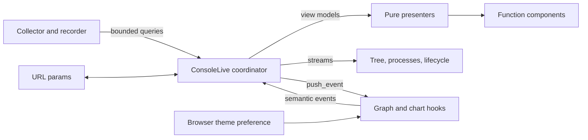

# Dashboard Architecture: Process Flight Recorder

## Recommendation

Keep one `BeamConsoleWeb.ConsoleLive` as the subscription and URL-state coordinator for all four tabs, but reduce it to lifecycle callbacks and LiveView effects. Move snapshot-to-view transformations into pure, bounded presenters; move HEEx into stateless function components; and split the browser client into theme, disclosure, graph, and chart modules that are bundled into the existing self-contained asset.

The core rule is that a browser session must never retain the complete `BeamConsole.Snapshot`. The current collector can inspect up to 20,000 processes, and `ConsoleLive` currently assigns that entire map to every socket even though the process list is streamed. A LiveView should retain only small navigation state, summary counts, selected-entity data, and recorder revisions. It should consume a snapshot transiently to reset streams and push bounded graph/chart payloads.



Do not create one LiveView per tab. The tabs share a collector subscription, selected entity, application tree, and inspector; separate LiveViews would duplicate lifecycle code and remount on every tab change. Use four live actions routed to the same module so navigation stays URL-backed and uses LiveView patches.

## Current Code Findings

- `lib/beam_console_web/console_live.ex` is 525 lines and currently owns subscription, URL parsing, snapshot retention, process streaming, graph delivery, selection resolution, formatting, and the entire page template.
- `load_snapshot/2` assigns `%Snapshot{}` to the socket. This dominates per-browser memory and defeats much of the benefit of streaming the process list.
- `lib/beam_console_web/graph.ex` is already mostly a pure presenter, but its name and Phoenix compile guard obscure that role. Its 160-process bound and opaque scalar payload are good constraints to preserve.
- `priv/static/beam_console.mjs` combines the self-hosted LiveSocket, theme persistence, Cytoscape styling, graph reconciliation, and hook registration. It is still manageable at 209 lines, but adding disclosure persistence and two chart tabs here would make it difficult to review and test.
- `priv/static/beam_console.css` is 967 lines. It remains correctly namespace-scoped, but tab, timeline, chart, and responsive styles should have maintainable source modules rather than extending one authored file indefinitely.
- Optional Phoenix packaging is already sound: Mix dependencies are optional, Phoenix-facing modules are guarded with `Code.ensure_loaded?/1`, assets are served from `priv/static`, and the plain-host fixture compiles without Phoenix. The redesign should preserve this exact boundary.
- The collector already broadcasts bounded `Diff` values, but `Diff.changed` is an ID list based on whole-struct inequality. Since reductions normally change on every sample, it is not a suitable activity series or top-mover input. Stopped-process labels are also unavailable after only the latest snapshot remains. The recorder must enrich lifecycle/activity records before the previous snapshot is discarded.
- `Snapshot` has no node-wide runtime sample. The Runtime tab therefore needs a normalized core data contract rather than calling `:erlang` APIs from presenters or LiveViews.

## Proposed Module Boundaries

```text
lib/beam_console/
  recorder.ex                         # bounded lifecycle and time-series query API
  lifecycle_event.ex                  # safe enriched observed event
  activity_sample.ex                  # bounded aggregate/top-mover sample
  runtime_sample.ex                   # allowlisted node-wide metrics
  application_tree_config.ex          # validated host overrides, no Phoenix dependency

lib/beam_console_web/
  console_live.ex                     # mount, handle_params, events, messages only
  console_live.html.heex              # shell composition and tab dispatch only
  console/
    params.ex                         # whitelist, normalize, and round-trip URL state
    paths.ex                          # prefix-aware paths for all live actions
    dashboard_presenter.ex            # shared header/status/inspector view model
    application_tree_presenter.ex     # categories, applications, counts, stable IDs
    graph_presenter.ex                # current BeamConsoleWeb.Graph responsibility
    lifecycle_presenter.ex            # recorder events to rows
    activity_presenter.ex             # activity queries to bounded chart payloads
    runtime_presenter.ex              # runtime queries to bounded cards/charts
    inspector_presenter.ex            # entity-specific allowlisted details
  components/
    shell_components.ex               # header, tabs, status, search, theme control
    tree_components.ex                # category/application branches
    process_map_components.ex         # graph stage and process stream
    lifecycle_components.ex           # observed-event stream and filters
    activity_components.ex            # chart shells and top movers
    runtime_components.ex             # runtime cards and chart shells
    inspector_components.ex           # selected entity detail
```

The exact file count can be collapsed if a module stays small, but the responsibility boundaries should remain. In particular:

- Presenters are pure functions over normalized core structs plus normalized params and config. They do not call `Process`, `Application`, the collector, Phoenix, or browser encoders.
- Function components only render presenter view models. They do not query runtime state, read application config, or own shared selection.
- `ConsoleLive` is the only module that handles sockets. No presenter or component receives a socket.
- Stateful LiveComponents are unnecessary. Tabs, filters, tree selection, and inspector selection are shared parent state; function components with events targeting `ConsoleLive` avoid synchronization problems.
- Phoenix-dependent modules remain guarded. Pure console presenters may compile unconditionally because they use only BeamConsole structs and maps, but they must not mention Phoenix modules in code or typespecs. Components, `ConsoleLive`, router, layout, hooks, and asset controller retain their `Code.ensure_loaded?` guards.

## LiveView State and Update Flow

The long-lived socket should keep only:

- `:tab`, `:query`, `:window`, `:event_filter`, `:node_id`, and `:selected_id` from normalized URL state.
- `:sequence`, `:sampled_at`, `:loading?`, bounded summary counts, coverage warnings, and a small selected-entity view model.
- `:graph_revision` and `:recorder_revision`, not graph elements or chart points.
- Small booleans such as refresh pending and stream empty-state flags.
- Streams for process rows, application-category rows, lifecycle events, and top-mover rows.

Do not assign `:snapshot`, full application/process maps, lifecycle history, or chart series. On a snapshot notification:

1. Fetch the latest snapshot into a local variable.
2. Ignore it when its sequence is not newer than the socket sequence.
3. Build the shared summary, category rows, process rows, and selected detail through pure presenters.
4. Reset only streams visible or shared by the current tab.
5. Push graph data only on Process Map.
6. Schedule a coalesced chart flush only on Activity or Runtime.
7. Drop the local snapshot when the callback returns.

The application tree can be a stream of category view models. Each streamed category contains a bounded list of applications for that category, so LiveView releases the nested data after rendering while the DOM retains it. The process stream keeps the existing hard display limit. The lifecycle stream should retain a fixed newest window, for example 250 events, using a stream limit. Filtering resets it from a bounded recorder query.

Subscription remains guarded by `connected?/1`. The disconnected render should show a shell/loading state without performing a second full runtime projection. On connected mount, subscribe once, consume the latest snapshot returned by `BeamConsole.subscribe/1`, and request a refresh only when no sample exists.

## URL-Backed Tabs and Selection

Add four routes to the existing scoped `live_session`, all targeting the same module:

```text
/beam             -> :process_map
/beam/lifecycle   -> :lifecycle
/beam/activity    -> :activity
/beam/runtime     -> :runtime
```

The existing `/beam` URL remains the Process Map entry point. Tab links use `patch`, and server events use `push_patch`, because the target remains the same LiveView in the same live session. `handle_params/3` is the source of truth for tab and selection state.

| Parameter | Tabs | Meaning |
|---|---|---|
| `entity` | all | Opaque selected node, application, or process ID |
| `node` | all | Opaque node scope; local node by default |
| `q` | Process Map, Lifecycle | Bounded search text |
| `edges` | Process Map | Whitelisted edge-set preset, never arbitrary terms |
| `kind` | Lifecycle | Whitelisted observed event filter |
| `window` | Activity, Runtime | Whitelisted recorder window such as `1m`, `5m`, `15m` |

`BeamConsoleWeb.Console.Params` should parse and cap strings, reject unknown enum values, and never create atoms. `Paths` should build routes from the mount prefix and normalized actions rather than depend on a host router helper. A tab change preserves `node` and `entity`, while tab-specific filters are retained only when they apply. Invalid or vanished entities render a stable “no longer available” inspector state without resolving any PID or module name from client input.

Category disclosure state is intentionally not URL state. Expanded branches are a browser presentation preference, not a shareable runtime selection. Persist them in local storage, namespaced by mount prefix and node ID.

## Categorized Application Tree

Use a small fixed default taxonomy:

1. `:host` — host/top-level applications.
2. `:dependencies` — non-OTP applications required by or running beside the host.
3. `:otp` — applications shipped from the Erlang/OTP root.
4. `:tooling` — BeamConsole and explicitly designated development/runtime tools.
5. `:unattributed` — a virtual branch for sampled processes without application attribution.

Classification precedence should be deterministic:

1. Explicit `application_categories` host mapping.
2. Optional server-side classifier MFA returning a configured category ID or `:default`.
3. Explicit `host_applications` list.
4. BeamConsole itself as `:tooling`.
5. OTP provenance inferred server-side as `:otp`.
6. Inferred top-level applications as `:host`.
7. Remaining non-OTP applications as `:dependencies`.
8. Processes with no application as `:unattributed`.

Top-level inference should use the started-application dependency graph: candidates are non-OTP applications not required by another non-OTP started application. This is a useful default, not a claim of exact ownership. When inference is used, show a small coverage note and let hosts make it exact.

The runtime adapter should collect only safe inference facts into `ApplicationInfo`, such as required application names and a boolean/provenance enum indicating OTP origin. Never send application paths to the browser. The presenter applies labels and ordering.

Host overrides belong in server-side BeamConsole config, not in the signed client-readable LiveView session:

```elixir
config :beam_console, :application_tree,
  host_applications: [:my_app, :my_app_web],
  category_order: [:host, :dependencies, :otp, :tooling, :unattributed],
  category_labels: %{host: "My application", dependencies: "Libraries"},
  application_categories: %{phoenix: :dependencies},
  classify_application: {MyApp.BeamConsoleCategories, :classify, []}
```

Normalize and validate this config once in a Phoenix-independent `ApplicationTreeConfig`. Callback results must be limited to configured category IDs. The callback receives normalized `ApplicationInfo`, never raw runtime state or client values. Keep the router session minimal so host modules, callback arguments, and policy details are not exposed to the browser.

Render each category and application as native `<details>` branches with stable IDs and visible counts. A delegated disclosure hook records `toggle` events and reapplies stored state in `updated/0`; it must not use `phx-update="ignore"` on the tree because LiveView still owns its rows. Selecting a node/application patches `entity` and focuses the graph or list without changing disclosure state.

## Tab Contracts

### Process Map

- Shared categorized app tree, bounded process stream, Cytoscape topology, and inspector.
- Preserve the current 160-node graph bound and stable-position patching behavior.
- Add edge presets such as supervision-only and relationships through a whitelist; do not send all runtime relationships by default.
- Keep graph payloads scalar and opaque. The graph hook sends only semantic `select_entity` and view-control events.

### Lifecycle

- Stream enriched `LifecycleEvent` rows: observed start, observed stop, topology edge added/removed, and explicitly sampled threshold events.
- Capture label, node ID, application, safe category inputs, sequence, and timestamp when the diff is produced. A stopped process cannot be safely described by looking it up in the latest snapshot.
- Use “observed” language throughout; polling is not a lossless trace.
- Apply search/type/application filters through a bounded recorder query, then reset the stream. Include an omitted count when the query cap is reached.

### Activity

- Present process-centric sampled activity: reductions delta, mailbox movement, memory movement, and bounded top movers.
- Do not derive it from `Diff.changed`; compute scalar deltas while both snapshots are available, rank them before capping, and store a bounded `ActivitySample`.
- Prefer node/application aggregates plus a small top-mover set. Do not retain a full time series for every sampled process. If selected-process history is supported, use a global sparse-change budget and state clearly when points were omitted.

### Runtime

- Present allowlisted node-wide measurements through `RuntimeSample`: process/application/supervisor/ETS counts, BEAM memory categories, scheduler/run-queue signals, and recorder/collector health.
- Runtime data is collected in the framework-independent runtime layer. `ConsoleLive` and presenters must not call `:erlang.memory/0`, `:erlang.statistics/1`, or ETS APIs directly.
- Connected nodes remain inventory-only until a remote adapter supplies the same normalized contracts.

## Bounded Chart Delivery

Charts should be client-owned surfaces updated with `push_event/3`, not HEEx trees rebuilt from point arrays.

Recommended server contract:

```text
chart payload
  id              stable chart ID
  revision        monotonically increasing recorder revision
  window_ms       whitelisted window
  sampled_at_ms   integer timestamp
  unit            allowlisted display unit
  series[]        key + label + points
  points[]        [timestamp_ms, scalar_value]
  omitted         count or boolean
```

Bounds should be enforced by the recorder/presenter, not trusted from browser params:

- At most 240 points per series after fixed-window bucketing or deterministic decimation.
- At most 6 series per chart and 4 chart payloads for one tab refresh.
- At most 25 top-mover rows per sample and 250 lifecycle rows per query.
- One chart flush pending per LiveView. New collector notifications coalesce into that flush.
- No full snapshots, PIDs, application paths, arbitrary Erlang terms, or repeated metadata in point arrays.

Send chart events only while the corresponding tab is active. The hook rejects older revisions and payloads for a prior window, mutates the existing renderer instead of rebuilding it, and destroys charts/listeners on unmount. Put `phx-hook` on a stable wrapper with a unique ID and `phx-update="ignore"` only on the renderer-owned child. Keep titles, legends, empty/error states, and accessible summary values in LiveView-owned HTML.

The first implementation can use a small native SVG/canvas renderer; a chart library is justified only if it remains self-contained and materially improves accessibility or interaction. Either way, graph and charts use separate hooks and payload contracts.

## Theme Persistence

Keep theme as browser-owned preference. It does not belong in LiveView assigns or URL params.

- Extract the current theme code into a `theme_controller` module.
- Support validated `system`, `light`, and `dark` modes under a versioned, namespaced storage key.
- Use CSS `prefers-color-scheme` as the no-JavaScript/system default, apply a stored override before initializing graph/charts, and listen for both media-query and cross-tab storage changes.
- Scope CSS variables beneath the BeamConsole document/shell. The package currently owns a root layout, so applying a data attribute to its document is safe, but graph/chart palette reads should still originate from their BeamConsole container.
- Dispatch one namespaced theme-change event consumed by graph and chart hooks. Restyle existing renderers without replacing their data or positions.
- Keep the theme control as a pure function component; its label and `aria-pressed`/mode state are synchronized by the theme hook.

## Browser Asset Structure

Author readable source modules and build one committed distribution asset:

```text
assets/js/
  beam_console.js                    # entry, LiveSocket, hook registry
  theme_controller.js
  hooks/application_tree.js
  hooks/graph.js
  hooks/chart.js
  graph/style.js
  graph/reconciler.js
  charts/payload.js

assets/css/
  tokens.css
  shell.css
  tabs.css
  tree.css
  graph.css
  inspector.css
  lifecycle.css
  charts.css
  responsive.css

priv/static/
  beam_console.mjs                   # generated and committed
  beam_console.css                   # generated and committed
  cytoscape.esm.min.mjs              # existing vendored dependency
```

The Hex consumer must never run npm. Add a maintainer-only asset build/check script that bundles first-party modules into the existing `priv/static` files; keep Phoenix, LiveView, and Cytoscape digest placeholders or external imports compatible with `BeamConsoleWeb.Assets`. The controller continues to serve a single BeamConsole client, stylesheet, and vendored modules under immutable digest URLs.

Avoid serving many first-party ESM files as individual controller routes. That expands the router and digest surface without helping consumers. Source modularity and distribution modularity have different goals.

## Optional Phoenix Packaging

Preserve these constraints explicitly:

- Keep Phoenix, Phoenix HTML, LiveView, and Jason optional in `mix.exs`.
- Keep all modules that `use` or reference Phoenix runtime types inside `Code.ensure_loaded?/1` guards.
- Keep recorder, categorization, params-independent data contracts, and runtime collection free of Phoenix dependencies.
- Do not store host callback MFAs or configuration maps in the LiveView session. Resolve them server-side.
- Continue packaging generated browser assets in `priv/static`; plain Elixir consumers do not load them.
- Retain the plain-host fixture as a required compile test and the Phoenix test endpoint/router as the embedded-web integration test.
- Keep the package root layout and isolated LiveSocket so adding BeamConsole still requires no host asset edits.

## Verification Seams

- Params/path round trips for every tab under nested mount prefixes; invalid enum values normalize without atom creation.
- Categorizer precedence, top-level inference, umbrella host overrides, custom labels/order, callback validation, and unattributed processes.
- Presenter determinism and hard caps for graph, lifecycle, activity, runtime, and chart payloads.
- LiveView tests asserting tab patches, selection persistence, active-tab-only graph/chart events, streamed empty states, and stale sequence rejection.
- A memory-oriented test or state inspection asserting `ConsoleLive` does not retain `%Snapshot{}` or chart point arrays after rendering.
- Hook tests for disclosure persistence, stale chart revision rejection, theme restoration/media changes, graph position preservation, and cleanup.
- Existing immutable asset route/digest tests plus a generated-asset freshness check.
- Compilation and tests both with Phoenix present and through `fixtures/plain_host` without optional Phoenix dependencies.

## Suggested Order

1. Introduce params/paths and four live actions without changing the Process Map behavior.
2. Extract presenters and function components, then remove the full snapshot from socket assigns.
3. Add categorized tree inference/config and browser disclosure persistence.
4. Add enriched bounded recorder contracts for Lifecycle, Activity, and Runtime.
5. Add each tab using streams and bounded payloads.
6. Split and bundle first-party JavaScript/CSS sources while preserving the current public asset routes.

This order preserves the working embedded console while creating the seams needed for the recorder-driven tabs.
